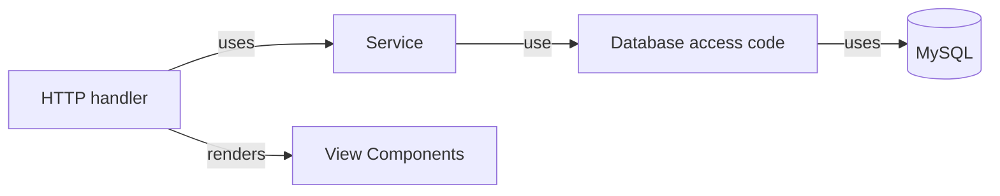

## Application architecture

A technically partitioned closed layer architectural style.

* HTTP Handler
  * Processes HTTP requests
  * Does not contain application logic itself
  * Uses `service` that carry out application logic
  * Takes the responses from `service` and uses `view` to render HTML
  * Creates HTTP responses
* Services
  * Carries out application logic such as orchestrating API calls, or making database calls
  * Does not do anything related to HTML or HTTP
  * Is not aware of the specifics of database calls
* Database access code
  * Handles database activity such as inserting and querying records
  * Ensures that the database representation (`records`) doesn't leak to the service layer

  ## Dev Environment

  - VSCode as IDE
  - Templ for static rendering
  - Taskfile for automation
  - wgo for live reloading
  - migrate for database migrations
  - docker compose for dev dependancies
  - MySQL for  storage